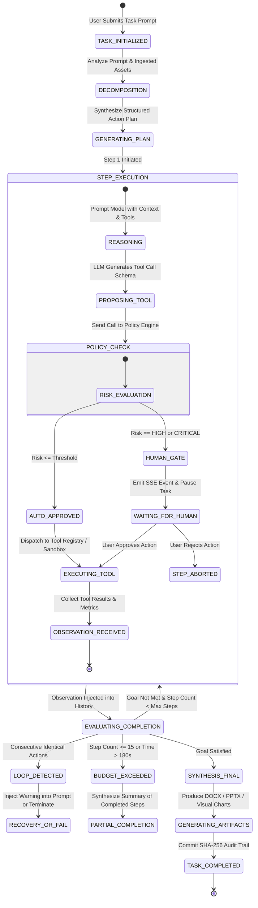

# SOVEREIGN-X — Agentic Architecture & Orchestration Engine

---

## 1. Agent Design Philosophy & Principles

SOVEREIGN-X employs a deterministic, bounded **ReAct (Reasoning + Action)** agent loop. The agent is strictly bounded and monitored to guarantee stability in mission-critical environments:
1. **Never Autonomous OS Access**: The agent cannot spawn shell processes or touch host file paths.
2. **Explicit Action Budgeting**: Every task is constrained by step limits, tool call quotas, and execution timeouts.
3. **Loop & Oscillation Detection**: The agent engine tracks semantic repeats in tool invocations and aborts if it detects circular reasoning.
4. **State Machine Traceability**: Every state transition, thought snippet, tool call argument, and observation is persisted to SQLite and streamed to the UI via Server-Sent Events (SSE).

---

## 2. ReAct Agent State Machine



---

## 3. Agent Execution Limits & Safety Budgets

To ensure zero lockups and strict resource compliance on consumer laptop hardware:

| Parameter | Default Limit | Hard Ceiling | Failure Action |
| :--- | :--- | :--- | :--- |
| **Max Steps Per Task** | `10 steps` | `15 steps` | Halt loop, synthesize partial progress report |
| **Max Tool Calls Per Step** | `1 call` | `3 calls` | Reject extra calls, force sequential evaluation |
| **Total Task Timeout** | `120 seconds` | `180 seconds` | Terminate active container/subprocess, return timeout error |
| **Single Tool Timeout** | `15 seconds` | `30 seconds` | Kill sandbox process, return `TIMED_OUT` observation |
| **Max Observation Size** | `16 KB` | `64 KB` | Truncate middle rows, retain header and tail summaries |
| **Loop Detection Window** | `3 actions` | `3 actions` | If same tool called with identical args 3x, force replanning |

---

## 4. Prompt Engineering & System Invariants

The agent system prompt enforces strict industrial reasoning guidelines:

```markdown
You are SOVEREIGN-X, an air-gapped industrial AI agent operating on confidential engineering data.
Your objective is to complete the user's task using verifiable tools.

CRITICAL INVARIANTS:
1. NEVER hallucinate measurements, part numbers, or safety thresholds.
2. Every technical assertion MUST be grounded in an ingested document, table, or calculation.
3. When referencing documents, provide exact source citations: [CIT: <filename>#page=<N>].
4. To analyze spreadsheets or run statistical math, ALWAYS use the `run_python_sandbox` tool.
5. If visual inspection is needed on images/diagrams, use the `inspect_image` tool.
6. When your plan is fully executed, produce the requested deliverables using `generate_docx` or `generate_pptx`.

AVAILABLE TOOLS:
{tool_schemas}

WORKSPACE CONTEXT:
Workspace ID: {workspace_id}
Indexed Documents: {document_manifest}
```

---

## 5. Human-in-the-Loop (HITL) Action Approval Workflow

When a tool action is classified as `HIGH` or `CRITICAL` risk (e.g., executing arbitrary statistical scripts or overwriting workspace files):

1. **Agent State Transition**: Task status shifts to `WAITING_APPROVAL`.
2. **SSE Broadcast**: Emits `APPROVAL_REQUIRED` event containing:
   - Tool Name (`run_python_sandbox`)
   - Human-readable description ("Execute Python degradation velocity calculation on maintenance history")
   - Full code diff / parameter payload preview
   - Specific risk reasons
3. **UI Presentation**: React UI displays an action authorization modal with "Approve Execution", "Reject", or "Edit Parameters".
4. **Resumption**:
   - On `POST /api/v1/workspaces/{id}/tasks/{task_id}/approve`: Agent receives approval token and resumes execution in Docker sandbox.
   - On rejection: Agent receives observation: `"Action rejected by operator: [Reason]. Please adjust your plan."`
