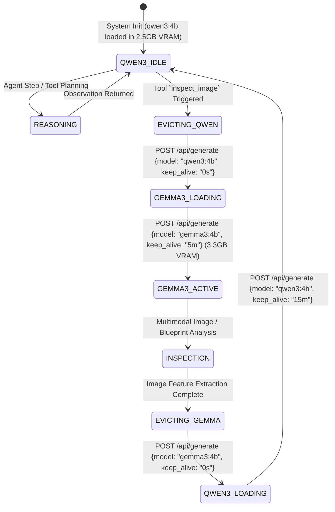

# SOVEREIGN-X — Model Strategy & Inference Architecture

---

## 1. Model Landscape & Hardware Realities

SOVEREIGN-X is engineered for predictable, deterministic inference on a single **NVIDIA GeForce RTX 3050 Laptop GPU** with **4.0 GB VRAM** running on Windows 11 with NVIDIA driver 610.62 and CUDA UMD 13.3.

### 1.1. Hardware Math & VRAM Constraints
- **Total Physical VRAM**: 4,096 MB
- **Windows OS / Desktop Window Manager (DWM) Overhead**: ~550 MB – 700 MB
- **Usable GPU VRAM for Models**: ~3,350 MB – 3,500 MB
- **Ollama Invariant**: `OLLAMA_NO_CLOUD=1` configured locally (Endpoint: `http://localhost:11434`).

Because our primary reasoning model and vision model have combined footprints of $2.5\text{ GB} + 3.3\text{ GB} = 5.8\text{ GB}$, **they cannot be co-resident in GPU VRAM**. The architecture implements an explicit, state-driven **Resource-Aware VRAM Arbitrator**.

---

## 2. Verified Local Model Portfolio

| Model ID | Base Weights | Quantization | Size on Disk | Active VRAM Footprint | Primary Role / Modalities | Max Context |
| :--- | :--- | :--- | :--- | :--- | :--- | :--- |
| **`qwen3:4b`** | Qwen 3.0 4B | Q4_K_M | ~2.5 GB | ~2,560 MB | **Reasoning Core**: Task planning, tool calling, code generation, SQL/pandas, RAG synthesis, DOCX structuring | 8,192 tokens |
| **`gemma3:4b`** | Gemma 3.0 4B | Q4_K_M | ~3.3 GB | ~3,350 MB | **Vision Specialist**: High-resolution image inspection, crack detection, P&ID visual comprehension, scanned blueprint layout | 4,096 tokens |

---

## 3. Provider Abstraction Architecture

Business logic, agent orchestrators, and tool managers **never call Ollama directly**. All interactions go through an abstract `LLMProvider` interface.

```
                             +-------------------------------+
                             |    <<interface>> LLMProvider  |
                             +-------------------------------+
                             | + generate(prompt, params)    |
                             | + generate_stream(prompt)     |
                             | + generate_structured(schema) |
                             | + inspect_image(image, prompt)|
                             | + get_memory_footprint()      |
                             +---------------+---------------+
                                             |
                      +----------------------+----------------------+
                      |                                             |
       +--------------v---------------+              +--------------v---------------+
       |        OllamaProvider        |              |     (Future Local llama.cpp/ |
       |                              |              |      vLLM Provider)          |
       | - http://localhost:11434     |              | - C++ Bindings               |
       | - keep_alive management      |              | - Direct CUDA Stream         |
       | - VRAM memory profiler       |              | - IPC Shared Memory          |
       +------------------------------+              +------------------------------+
```

---

## 4. Resource-Aware VRAM Arbitrator & Model Swapping

### 4.1. The VRAM State Machine
To guarantee zero Out-Of-Memory (OOM) failures or silent offloading to slow system RAM, the `ModelRegistry` coordinates model transitions:



### 4.2. Eviction & Swap Implementation Pattern
When switching from text reasoning to image inspection:
1. Issue an explicit Ollama unload call:
   ```json
   POST http://localhost:11434/api/generate
   {
     "model": "qwen3:4b",
     "keep_alive": 0
   }
   ```
2. Verify via `pynvml` that GPU VRAM usage drops below 800 MB.
3. Load `gemma3:4b` with the multimodal image payload.
4. Once image visual inspection observations are extracted into structured text, unload `gemma3:4b` and restore `qwen3:4b`.

---

## 5. Inference Profiles & Generation Parameters

| Task Scenario | Target Model | Temperature | Top-P | Context Window | System Prompt Strategy |
| :--- | :--- | :--- | :--- | :--- | :--- |
| **Agent Tool Calling & Planning** | `qwen3:4b` | `0.1` | `0.9` | 4,096 tokens | Strict JSON output schema, zero preamble |
| **Python Code Generation** | `qwen3:4b` | `0.0` | `0.95` | 4,096 tokens | Enforce pure Python, import restrictions |
| **RAG Fact Synthesis & Citation** | `qwen3:4b` | `0.2` | `0.9` | 6,144 tokens | Explicit provenance requirement, reject unsubstantiated facts |
| **Visual Crack / Defect Analysis** | `gemma3:4b` | `0.1` | `0.9` | 2,048 tokens | Output bounding coordinates, defect severity, confidence score |

---

## 6. Context Window Budgeting Strategy (8K Limit)

To prevent context truncation or degradation on `qwen3:4b`:
```
+---------------------------------------------------------------------------------+
| SYSTEM INVARIANTS & TOOL SCHEMAS       :  1,200 tokens  (15%)                   |
| RETRIEVED RAG PASSAGES (Max 4 chunks)  :  2,000 tokens  (25%)                   |
| SCRATCHPAD (Recent 3 ReAct Steps)      :  2,500 tokens  (31%)                   |
| USER PROMPT & WORKSPACE METADATA       :    500 tokens  (6%)                    |
| MODEL RESPONSE HEADROOM                :  1,996 tokens  (23%)                   |
+---------------------------------------------------------------------------------+
TOTAL CONTEXT BUDGET: 8,192 tokens
```
*If task history exceeds the step budget, the agent summarizes prior steps into an executive memory block before appending new observations.*
